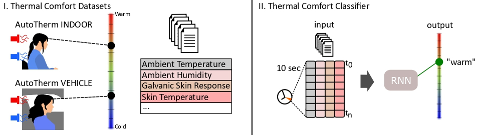

# AutoTherm: A Dataset and Benchmark for Thermal Comfort Estimation Indoors and in Vehicles 
[IMWUT](https://dl.acm.org/journal/imwut) Paper doi: [10.1145/3678503](https://dl.acm.org/doi/10.1145/3678503)

[Mark Colley*](https://scholar.google.de/citations?user=Kt5I7wYAAAAJ&hl=de&oi=ao), [Sebastian Hartwig*](https://scholar.google.de/citations?user=f8EwjvQAAAAJ&hl=de&oi=ao), [Albin Zeqiri](https://scholar.google.de/citations?user=UX-Ub5wAAAAJ&hl=de&oi=ao), [Timo Ropinski](https://scholar.google.de/citations?user=FuY-lbcAAAAJ&hl=de&oi=ao), [Enrico Rukzio](https://scholar.google.de/citations?user=LEu4D5gAAAAJ&hl=de&oi=ao)

For the full dataset, see the [HuggingFace page](https://huggingface.co/datasets/kopetri/AutoTherm).

## Dataset
Basic description:
* __Age__: M=24.64, SD= 3.03, range=[20, 33]
* __Gender__ : Male: 9, Female=12
* __Weight__: M=69.97, SD=15.02, range=[53, 106.9]
* __Height__: M=174.50, SD=10.18, range=[155, 198]
* __BodyFat__: M=0.22, SD=0.05, range=[0.14,0.34]
* __BodyTemp__: M=36.38, SD=0.31, range=[35.8, 37.2]
* __Meal__: M=4.23, SD=4.92, range=[0, 20]
* __Sport-Last-Hour__: Yes: 3, No: 18
* __Tiredness__:  M=4.12, SD=1.73, range=[2, 8]
* __Black-Globe-Temp__: M=25.53, SD=3.92, range=[16.9, 33.6]
* __Clothing-Level__: M=0.60, SD=0.05, range=[0.45, 0.69]
* __Heart-Rate__: M=2.94, SD=13.46, range=[40.0, 191.99]
* __Wrist-Skin-Temperature__: M=33.82, SD=1.75, range=[27.91, 36.95]
* __GSR__: M=1.42, SD=2.81, range=[0.0, 16.9]
*  __Ambient-Temp__: M=25.31, SD=3.72, range=[17.1, 33.7]
* __Relative-Humidity__: M=31.35, SD=8.86, range=[12.0, 55.0]
* __Emotion-ML__: Anger: 0.1099, Disgust: 0.0008, Fear: 0.1348, Happy: 0.0898, __Neutral: 0.4114__, Sadness: 0.2087, Surprise: 0.0446
* __Emotion-Self__: Anger:0.0083, Contempt: 0.0003, Disgust: 0.0314, Fear: 0.0003, Happiness: 0.0835, __Neutral: 0.8638__, Sadness: 0.0073, Surprise: 0.0049

## Preprocessing Steps
* Outlier removal based on continuous features
* Cleaning of empty lines
* Normalization
* Data augmentation

## Contact Details
For inquiries, contact [Mark Colley](mailto:m.colley@ucl.ac.uk) or [Albin Zeqiri](mailto:albin.zeqiri@uni-ulm.de)

